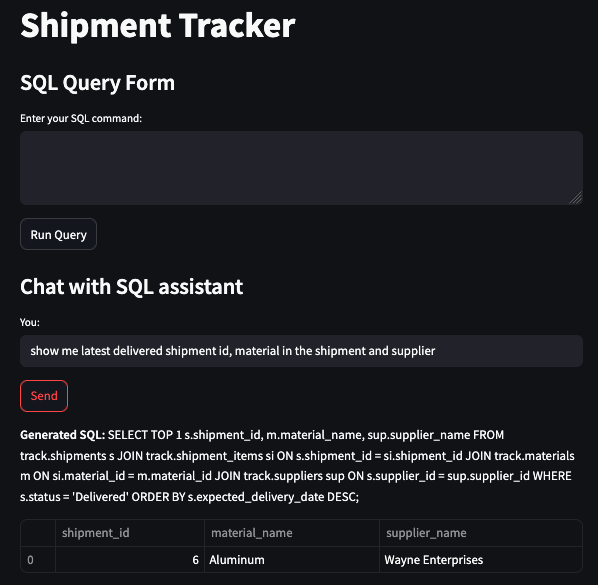

# Shipment Tracker — SQL + Chatbot App

This project provides an interactive solution for Buyers to track shipments using either direct SQL queries or a chatbot interface.

**Author:** Ross Pietukhov  

## Overview

This solution enables the Procurement team to easily monitor and track shipments using:

- An Azure SQL database with structured tables for shipments, materials, suppliers, and shipment items.

- A Streamlit web app offering:

  - A direct SQL query interface. 
  
  

  - An OpenAI-powered chatbot for natural language queries.
  

  - Built-in safeguards to allow only safe, non-destructive SELECT queries.
  
    
## Components
### 1. Azure SQL database
- Includes four core tables:

    - track.shipments

    - track.materials

    - track.suppliers

    - track.shipment_items

- Preloaded with sample (dummy) data for demo and testing.

### 2. Streamlit Frontend
- SQL Query Form: Users can input raw SQL commands to retrieve shipment data.
- Chatbot Query Form: Users can type natural language questions, and the app uses OpenAI to generate SQL queries behind the scenes.
- Safety Checks: Ensures only SELECT statements are run — no inserts, updates, or deletes.

## Technologies
- Python
- Streamlit
- OpenAI API
- Azure SQL Database
- SQLAlchemy

## Future Improvements
- Automate data updates from delivery service APIs (e.g., DHL, FedEx) using an Azure Data Factory pipeline to refresh the database every few hours.
- Send automatic notifications if shipments are delayed. 
- Add user authentication to control access.

## Licence
This project is licensed under the MIT Licence.

## Contributing

Feel free to open issues or contribute via pull requests!  
Your feedback and help are very welcome.
